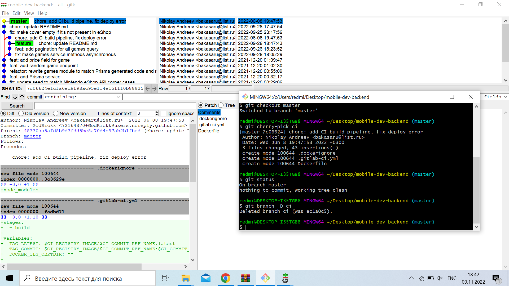
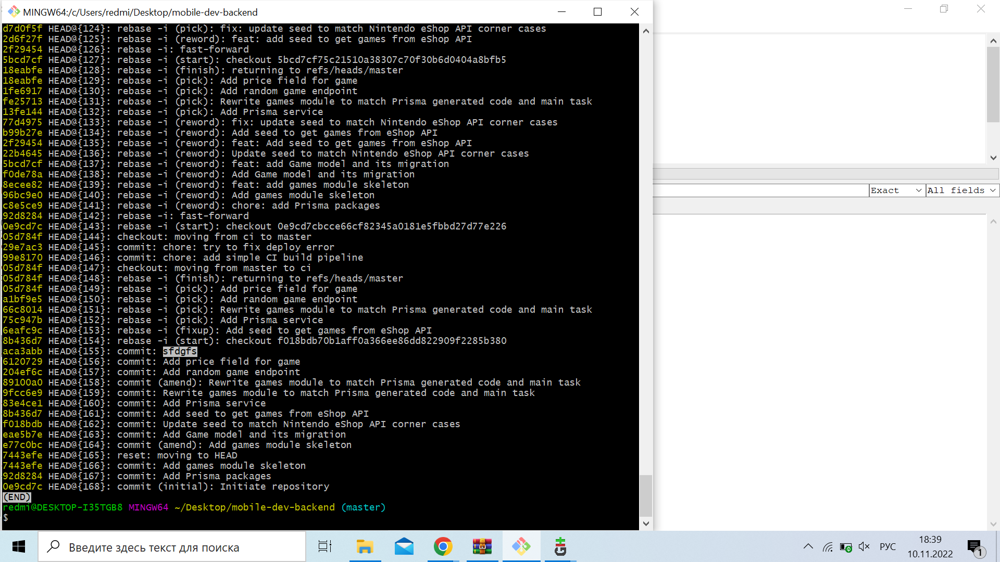
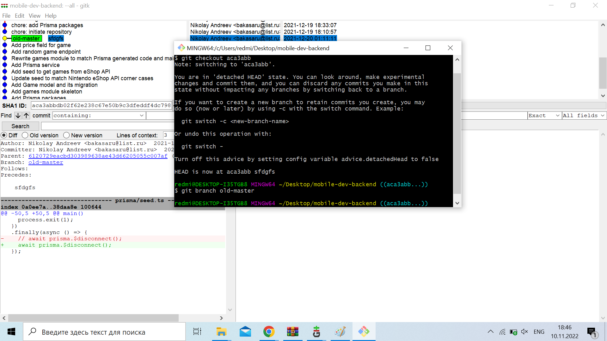
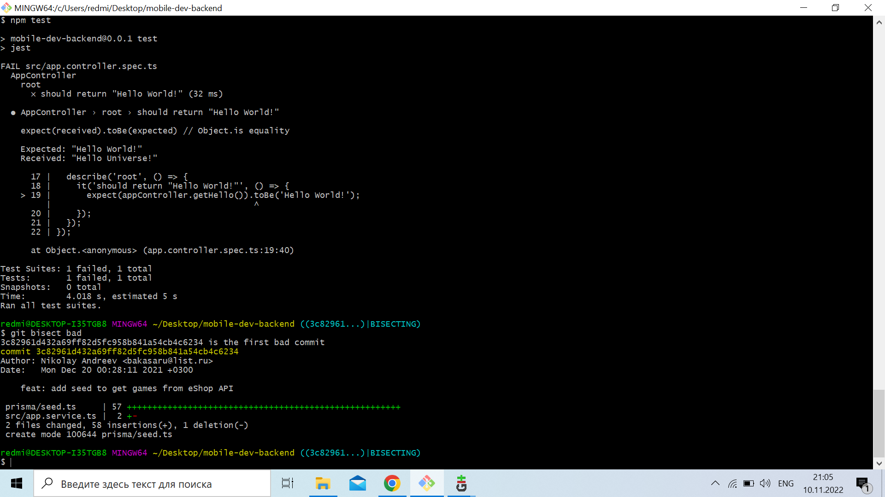
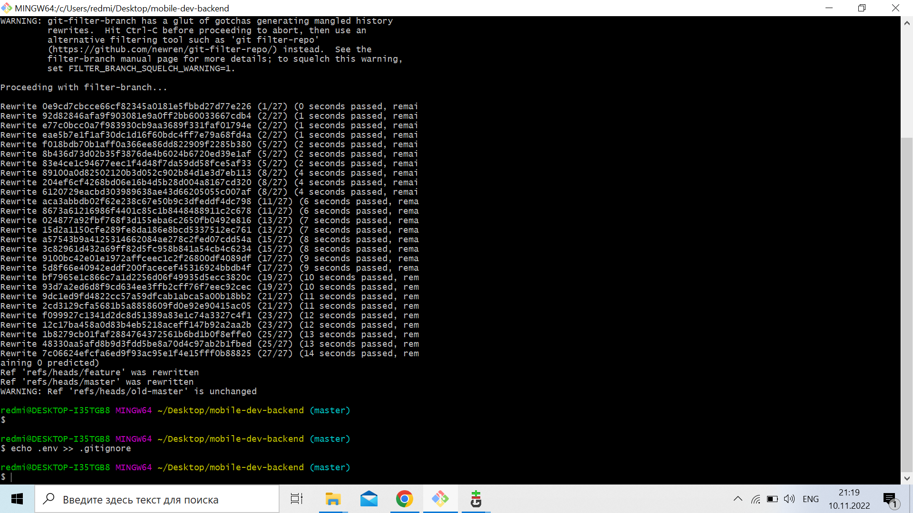

<!-- report name -->
# Devtools report lab-2

## Task 1

Запустите локальный веб-визуализатор репозитория и сделайте так, чтобы в нём отображалось нормальное описание репозитория.




## Task 2

Перенесите все коммиты, находящиеся в ветке ci, в ветку master с объединением всех коммитов в один и изменением сообщения таким образом, чтобы оно полностью описывало все вносимые изменения. Удалите ветку ci

<!-- code -->
```bash
git checkout ci
git rebase -i HEAD~2
git checkout master
git cherry-pick ci
git checkout master
git branch -D ci
```


## Task 3

`git reflog`

`git checkout aca3abb`
`git branch old-master`





## Task 4

```
git blame prisma/seed.ts
3c82961d (Nikolay Andreev 2021-12-20 00:28:11 +0300 32)      rating: game.age_rating_sorting_i
```


## Task 5

```
npm install --save-dev jest
git checkout master
git bisect start
git bisect bad
git bisect good 
npm run test
```




## Task 6

```
git filter-branch --tree-filter "rm -f .env" -- --all
echo .env >> .gitignore
```


